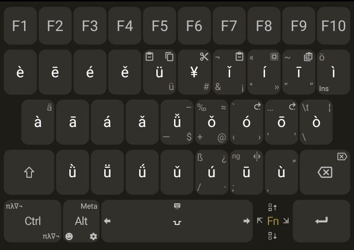

These are my custom layouts for [Unexpected-Keyboard](https://github.com/Julow/Unexpected-Keyboard)
# Preview
## Normal
||
| ----- |
| Qwerty |

||
| ----- |
| Arabic |

## Fn Modifier
|  |
| ----- |
| Qwerty with pinyin diacritics |

